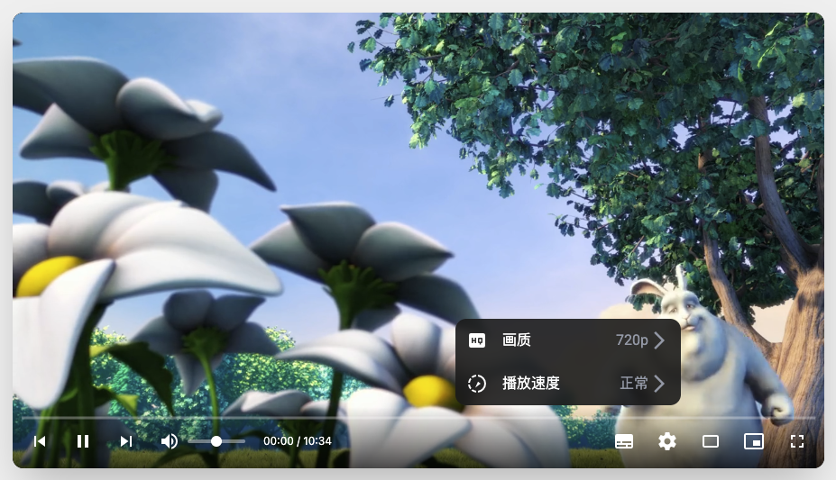

# YouTube 风格全功能 HTML5 视频播放器

这是一个使用原生 HTML, CSS 和 JavaScript 构建的现代化、功能丰富的视频播放器。它模仿了 YouTube 的设计和交互体验，并集成了 HLS.js 以支持自适应流媒体播放。整个项目是独立的，仅需一个 HTML 文件即可运行，并使用了 Tailwind CSS 进行样式设计。


*(提示: 您可以将此图片替换为您自己播放器的截图)*

---

## ✨ 主要功能

* **HLS 流媒体支持**: 使用 `hls.js` 库，支持播放 `.m3u8` 格式的自适应比特率流媒体。
* **动态画质切换**: 自动解析视频流中的不同画质，并允许用户在 "自动" 和特定分辨率（如 1080p, 720p）之间自由切换。
* **播放列表**: 支持多个视频的播放列表，可轻松切换上一个/下一个视频，并在当前视频播放结束后自动播放下一个。
* **可定制字幕**: 支持 VTT 格式的字幕，并提供一键开启/关闭功能。
* **丰富的播放控制**:
    * 播放/暂停 (单击按钮、双击视频区域或按空格键)
    * 音量调节与静音
    * 播放进度条拖拽 (Scrubbing)
    * 鼠标悬停在进度条上可预览时间
    * 播放速度控制 (0.5x, 0.75x, 1x, 1.25x, 1.5x, 2x)
* **多种视图模式**:
    * **影院模式**: 扩展播放器宽度以获得更沉浸的观看体验。
    * **画中画 (PiP)**: 将视频以小窗口形式置顶显示。
    * **全屏模式**: 充满整个屏幕。
    * **迷你播放器**: 当播放器主体滚动出可视区域时，自动切换到右下角的迷你播放器模式。
* **现代化的 UI/UX**:
    * 使用 Tailwind CSS 构建，界面美观且响应式。
    * 控件栏在暂停或鼠标悬停时自动显示，播放时自动隐藏。
    * 优雅的设置菜单，用于调整画质和播放速度。
    * 视频加载时显示 Loading 动画。
* **用户偏好记忆**: 使用 `localStorage` 自动保存并应用用户上次设置的音量、播放速度和字幕开关状态。
* **全面的键盘快捷键**: 支持类似 YouTube 的快捷键操作，提升使用效率。

---

## 🚀 如何使用

这个项目最大的优点是 **无需构建工具，开箱即用**。

1.  **下载文件**: 只需获取 `index.html` 文件。
2.  **修改播放列表**: 在 `<script>` 标签内，找到 `playlist` 数组。您可以根据自己的需求修改它：

    ```javascript
    const playlist = [
        { 
            title: "你的视频标题 1", 
            src: "https://你的视频流.m3u8", 
            subtitles: "data:text/vtt,WEBVTT\n\n00:00:05.000 --> 00:00:10.000\n这是第一句字幕。\n" 
        },
        { 
            title: "你的视频标题 2", 
            src: "http://另一个视频.m3u8", 
            subtitles: "你的vtt字幕文件路径.vtt" // 也可以是外部文件
        },
        // ...可以添加更多视频
    ];
    ```
    * `title`: 视频标题（当前版本未在 UI 中显示，可用于未来扩展）。
    * `src`: 视频源地址，推荐使用 HLS (`.m3u8`) 格式以获得最佳体验。普通 MP4 视频也能播放，但无法切换画质。
    * `subtitles`: 字幕源。可以是 VTT 格式的 Data URI，也可以是 `.vtt` 文件的 URL。

3.  **部署**: 将修改后的 `index.html` 文件部署在任何静态文件服务器或 web 服务器上即可。**注意**: 由于浏览器安全策略，直接以 `file://` 协议在本地打开可能导致 HLS.js 或字幕加载失败，建议使用本地服务器环境进行测试（如 VS Code 的 Live Server 插件）。

---

## 🛠️ 技术栈

* **HTML5**: 页面结构和 `<video>` 元素。
* **Tailwind CSS**: 用于快速构建现代化的响应式界面。通过 CDN 引入，无需本地安装。
* **JavaScript (ES6+)**: 实现所有播放器逻辑和交互。
* **HLS.js**: 一个强大的 JavaScript 库，用于在不支持 HLS 的浏览器上实现 HTTP Live Streaming 播放。

---

## ⌨️ 键盘快捷键

| 按键 | 功能 |
| :--- | :--- |
| `空格键` 或 `K` | 播放 / 暂停 |
| `M` | 静音 / 取消静音 |
| `F` | 进入 / 退出全屏 |
| `T` | 进入 / 退出影院模式 |
| `P` | 进入 / 退出画中画模式 |
| `C` | 显示 / 隐藏字幕 |
| `→` (右箭头) | 快进 5 秒 |
| `←` (左箭头) | 快退 5 秒 |
| `L` | 快进 10 秒 |
| `J` | 快退 10 秒 |

---

## 📜 许可证

本项目采用 [MIT License](https://opensource.org/licenses/MIT) 授权。欢迎自由使用、修改和分发。

